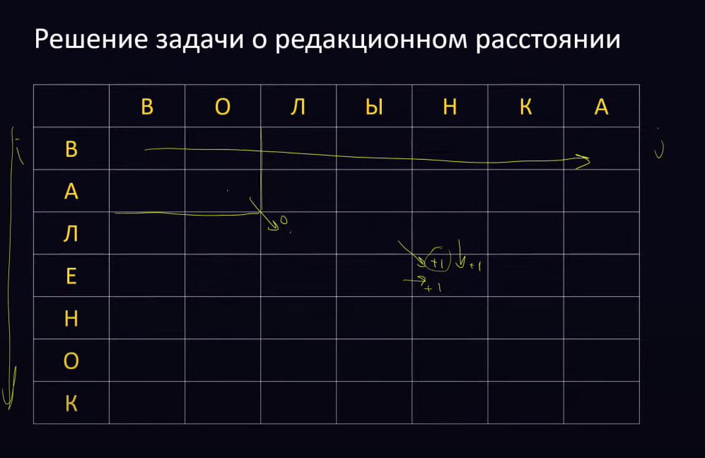
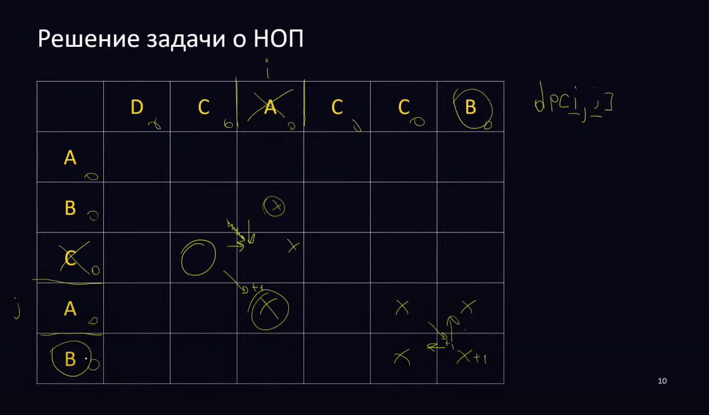

## Содержание:
* Тренировки 2.0:
  1. [Линейный поиск](#линейный-поиск)
  2. [Множества](#множества)
  3. [Словари и сортировка подсчетом](#словари-и-сортировка-подсчётом)
  4. Префиксные суммы
  5. Два указателя
  6. Бинарный поиск
  7. Сортировка событий
  8. Бинарные деревья
___
* Тренировки 3.0:
  1. [Стеки](#стеки)
  2. [Очереди, Деки, Бинарные кучи и Приоритетные очереди](#очереди-деки-бинарные-кучи-и-приоритетные-очереди)
  3. [Одномерное ДП](#одномерное-дп-1-d-dp)
  4. [Двумерное ДП, ДП по подотрезкам](#двумерное-дп-2-d-dp-и-дп-по-подотрезкам)
  5. [DFS](#dfs-обход-в-глубину)
  6. [BFS](#bfs-обход-в-ширину-волновой-алгоритм)
___
* Дополнительные материалы:
  * Will be soon...

# Линейный поиск:


<details>
<summary>Задачи:</summary>

### 1. Pitcraft


### 2. RLE (run-length encoding, Кодирование длин серий)


  Решим сначала упрощенную задачу:


  Теперь и полную:


</details>


# Словари и сортировка подсчётом.

## Сортировка подсчётом.


Есть массив из N целых чисел в диапазоне от 0 до K.
(Разброс не очень большой)

Тогда можно сделать сортировку за `O(N + K)` и `O(K)` доп. памяти: \
Считаем количество вхождений каждого числа, затем каждое число выводим столько раз, сколько оно встречалось.

Интервал значений можно сдвинуть, чтобы он был не от 0 до K, а от  минимального до максимального значения в массиве.

Если данные разреженные, то сортировку подсчетом использовать неразумно.

```py
def countsort(seq):
    minval = min(seq)
    maxval = max(seq)
    k = maxval - minval + 1
    count = [0] * k

    for now in seq:
        count[now - minval] += 1
    nowpos = 0
    for val in range(k):
        for i in range(count[val]):
            seq[nowpos] = val + minval
            nowpos += 1
```


### Задача:
Можно ли получить первое число из второго перестановкой цифр? Считаем количество вхождений каждой цифры в числа и сравниваем.

## Словари
Словарь - то же множество, но каждому клчюу приписано значение: `(key, value)`. `key` должен быть **неизменяемым** объектом, а вот `value` может быть чем угодно.

Искать по значению нельзя.

Const заметно больше, чем у массивов, поэтому, если возможно, лучше использовать сортировку подсчетом.

<details>
<summary>Задачи</summary>

### Задача:
**На доске N x M есть M ладей, задаются парой чисел i, j. Сколько пар ладей бьют друг друга?**

**Идея:** Сделаем 2 словаря - для горизонтали и вертикали. Запишем для каждой занятой горизонтали и вертикали количество ладей в них. Количество пар ладей, бьющих друг друга = колво ладей в ряду - 1. Суммируем это количество пар.

**Сложность: O(M)**

Если в задаче ферзь, то идея та же, только считаем еще и диагонали.\
i - j = const диагональ вида  y = kx
i + j = const диагональ вида  y = -kx
Делаем еще 2 словаря для диагонали.

### Гистограмма


Считаем, сколько раз каждый символ встречается. Находим самый частый символ, идем циклом от этого числа до 1, циклом по отсортированным ключам. Если количество >= счетчика, то печатаем #.


**Сложность:** `O(N^2)`в худшем случае.
</details>


# Множества

Основные операции:
1) Добавление элемента
2) Проверка наличия элемента
3) Удаление элемента

Порядок отсутствует

Используется хэш-функция:

Например, остаток от деления числа на 10.


Все рассуждения верны только для равномернораспределенных хэш-функций. (Значения получаются равновероятно).

Для неасимптотической оптимизации удаления можно после вычисления индекска и поиска элемента поменять его с последним и удалить с конца


<details>
<summary>Собственная реализация:</summary>

```py
setsize = 10
myset = [[] for _ in range(setsize)]

def add(x):
    if not find(x):
       myset[x % setsize].append(x)

def find(x):
    for now in myset[x % setsize]:
        if now == x:
            return True
        return False

def delete(x):
    xlist = myset[x % setsize]
    for i in range(len(xlist)):
        if xlist[i] == x:
            xlist[i] = xlist[len(xlist) - 1]
            xlist.pop()
            return 
```

</details>


Хэш-функцию можно использовать для сравнения объектов - если не совпадают хэши, то объекты гарантированно не совпадают. Если совпадают, то надо проверить, тк могла быть коллизия.


**Сложность добавления N элементов:**


**Амортизированная сложость:**

В системах реального времени программа должна гарантированно давать ответ за определенное время.
Не зная кода, завалить хеш-таблицу невозможно.

<details>
<summary>Задачи</summary>

### Сумма двух, равных X


### Входит ли слово (возможно, с одной пропущенной буквой) в словарь?


</details>


# Стеки

(Обратная польская запись)
Нужно обращать внимание на приоритет операций

Корректность инфиксной записи:
1)  ПСП
2) Нет 2 операндов подряд
3) Нет 2 операций подряд

    
Таким образом, у нас получается всегда убывающая(не возрастающая) по приоретету последовательность операций в результирующей строке.
А в стеке строго возрастающая последовательность(если смотреть от корня к вершине)

<details>
<summary>Задачи:</summary>

### Ближайший меньший справа

  
В стеке хранится неубывающая последовательность


**Сложность:** `O(n)`

### Сортировка вагонов - по сути перестановка чисел от 1 до n.
Известно, в каком порядке изначально идут вагоны поезда. Требуется с помощью указанных операций сделать так, чтобы вагоны поезда шли по порядку (сначала первый, потом второй и т.д., считая от головы поезда, едущего по пути 2 в сторону от тупика). Напишите программу, определяющую, можно ли это сделать.

**Идея:** Кладем вагон в стек. Пока вагоны в стеке  соответствуют порядковомым номерам, которые должны идти в отсортированном составе, вытаскиваем их из стека. В конце проверяем, что стек пуст.


```py
n = int(input())
wagons = list(map(int, input().split()))

stack = []
nowmin = 1

for wagon in wagons:
    stack.append(wagon)
    while stack and stack[-1] == nowmin:
        stack.pop()
        nowmin += 1


print("YES" if not stack else "NO") 
```
**Сложность:** `O(n)`
</details>

<details>
<summary>Рекурсия:</summary>


Функции можно мысленно разделить на 2 разные сущности - набор строк кода и ее состояние (значения локальных переменных, параметров).\
При каждом вызове в стеке ОС выделяется память под все, что функции надо - локальные переменные, параметры, точка возврата.\
После RETURN'а все удаляется, управление передается обратно по точке возврата.\
(Даже в железе в процессоре есть стек).


Куда вернуться - хранится в стеке.\
Объекты, создаваемые в динамической памяти, хранятся в куче.

Если создаем локальную переменную, то в стеке хранится локальная переменная - указатель на этот объект.


Делаем цикл: пока стек не пуст.\
Как моделируем запуск функции - выделяем память из стека\
Как моделируем работу функции с локальными переменными - их нет, на вершине стека вся память, внутри\
Как моделируем возврат - словари.

Каждый элемент стека - набор переменных, параметров, меток возврата (или понимание того, где мы сейчас находимся) (если несколько рекурсивных вызовов, то больше 2 значений)

Вызов функции - кладем элемент в стек, заполняем параметры, метка labelfrom = 0 и делаем continue


Наш стек выделится в куче.
</details>


# Очереди, Деки, Бинарные кучи и Приоритетные очереди
## Очередь:


Варианты реализации:

1. **Обычный динамически расширяемый массив** (Удаление из начала - `O(n)`)
   
2. **Динамически расширяемый массив с указателями `head` и `tail`**
   
3. **Кольцевой буфер** (Надо знать максимальное количество элементов, расширить можно так же, как динамический массив. В идеале, когда `tail` больше размера, выделяем новую память и копируем, а если `head` ушел вправо и слева много места не используется, то освобождаем ее и опять же копируем в область памяти поменьше.)
   

## Дек - двусторонняя очередь:


Варианты реализации:
1. **На динамическом массиве, но расширение влево сделать самим**
   
2. **На двусвязном списке**      
   
   (Можно на этом делать стеки, очереди, деки, но все это медленно:
      1) Выделение памяти медленное
      2) Прыжки по указателям медленные из-за архитектурных особенностей (можно выйти за пределы кеша в оперативную память)

   Работать будет, но накладно по памяти, тк таскаем с числом 2 указателя (больше в 3 раза, а если bool, то во много раз). 
   По скорости тоже не очень хорошо
   Зато никаких перевыделений памяти не надо, как на массиве)

3. **С помощью блоков**
   
   Храним данные блоками в массивах константного размера (1 блок - последовательная область памяти) и поддерживаем динамически расширяемый в 2 стороны массив указателей на каждый блок.
   Можно не очень эффективно, но обращаться по индексу `k%10`


## Куча

Очередь с приоритетами можно реализовать и на бин. дереве поиска. В случае сбалансированного дерева асимптотика будет хорошая - `O(logN)`

### Куча - бинарное дерево(у каждого элемента не более 2 детей)
Каждый элемент больше(меньше) своих детей.
Заполняется по слоям.

Координаты сыновей:
    `2 * pos + 1, 2 * pos + 2`\
Координаты родителя:
    `(pos - 1) // 2`


1) **Добавление в кучу (Просеивание вверх):** \
**Алгоритм (на примере кучи минимумов):** добавляем элемент в самый конец, затем, пока есть родитель и родитель меньше текущего элемента, меняем их местами.
<details>
<summary>Картинка:</summary>


</details>

```py
def insert(k: int):
    heap.append(k)
    pos = len(heap) - 1

    while pos > 0 and heap[pos] < heap[(pos - 1) // 2]:
        heap[pos], heap[(pos - 1) // 2] =\
            heap[(pos - 1) // 2], heap[pos]
        pos = (pos - 1) // 2
```


2) **Удаление из кучи (Просеивание вниз):** \
**Алгоритм (на примере кучи максимумов):** Последний элемент копируем на вершину, меняем с большим(меньшим в случае кучи min) из сыновей, если это нужно.
<details>
<summary>Картинка:</summary>


</details>

```py
def extract():
    ans = heap[0]
    heap[0] = heap[-1]
    heap.pop()

    #Siftdown:
    pos = 0
    while 2 * pos + 1 < len(heap):
        #Choosing min son:
        min_son_idx = 2 * pos + 1
        if 2 * pos + 2 < len(heap) and heap[2 * pos + 2] < heap[2 * pos + 1]:
            min_son_idx = 2 * pos + 2

        if heap[pos] > heap[min_son_idx]:
            heap[pos], heap[min_son_idx] =\
                heap[min_son_idx], heap[pos]
            pos = min_son_idx
        else:
            break
    return ans
# Можно сразу pop-нуть последний элемент, тогда если он останется, то возможны случаи:
# 1) в самом низу будет либо 2 листа, с собой мы элемент не поменяем => после while ничего не требуется
# 2) в самом низу будет только наш сам неудаленный элемент, мы с ним не поменяемся и потом удалим его.

# Чтобы поменять кучу min на max, надо изменить 3 знака в коде (1 в операции добавления, 2 в операции удаления)
```
Кол-во слоев в куче `logN`\
Сложность для просеиваний - `O(logN)`

Куча лучше по памяти и времени работы(не прыгаем по памяти и не держим указатели) бин дерева, если нужно только определять min(max), удалять min(max), добавлять элемент.

### Чтобы изменять элеметы, можно поддерживать словарь: приоритет-позиция:


Например, хотим `8 -> 3`. В словаре находим позицию 8 - это 5. Меняем `heap[5] = 3`. В словаре удаляем старую запись и создаем новую: `ключ: 3`. При необходимости просеиваем элемент(вверх или вниз). В словаре в качестве значений записываем новые позиции затронутых элементов.\
Короче говоря, поддерживаем словарь и кучу в консистентном состоянии.

Сложность: `O(logN)`

---

#### LRU кэш:


Если элемент в кеше, то просто обновляем последнее время для него.
Если приходит новый элемент, который не в кеше, удаляем элемент с минимальным временем и на его место кладем новый.


Можно это сделать без использования кучи.\
TODO:
[https://leetcode.com/problems/lru-cache/description/](https://leetcode.com/problems/lru-cache/description/)


#### Медиана в окне
Медиана - элемент, который стоит в середине после сортировки. 

1 куча на максимум с маленькими элементами, 1 куча на минимум с большими элементами.

На очередном шаге удаляем элемент по индексу из кучи. Добавляем новый. Сравниваем его с минимальным элементом большой кучи: если меньше - идет в маленькую, больше - идет в большую. При дисбалансе куч перекладываем максимум из кучи min в большую / минимум из кучи max в маленькую.

**Ответ** на каждом шаге - минимум во второй куче по определению медианы (1 число, которое больше k//2 других).\
(Если нечетное кол-во элементов, то правая куча размера k//2 + 1)

#### HeapSort (Пирамидальная сортировка (in-place))


У правой половины массива нет детей(так как дети определяются как `2i + 1, 2i + 2`), они уже кучки, а дальше превращаем все в кучи, двигаясь справа налево, чтобы быть уверенным, что наши дети уже явл. хорошими кучами, когда дошли до очередного индекса.


Для N/2 элементов вообще ничего не выполняем, для N/4 1 операцию(всего 1 ребенок), у N/8 2 операции (есть внуки), для N/16 3 операции(не более 4)(правнуки). Сумма ряда O(n)
(На каждом слое вдвое меньше элементов)

**Сложность** пирамидальной сортировки все равно `O(NlogN)` - тк N раз извлекаем из кучи

`Const` хуже, чем у qs и merge sort, связано с промахами кеша (cash miss) из-за прыжков, мы не попадаем на одну страницу памяти. В qs и ms идем последовательно, оказываемся в кеше

**Не требует доп. памяти** (O(1) для каких-то отдельных переменных независимо от размеров массива), другие сортировки требуют. 

Например, Терабайтный массив надо отсортить, а оперативки нет.


# Одномерное ДП (1-D DP)
**Примененяем, когда:** Есть какие-то различные стратегии "движения", нужно что-то оптимизировать(максимизировать, минимизировать).
Решение более крупной задачи зависит от решения менее крупных
`dp[i]` - оптимальное решеиние на i-ом шаге, основывется на определенных подзадачах, решенных ранее, не обязательно на прошлом шаге.

Сам параметр - i. 

<details>
<summary>Задачи:</summary>

### Ступеньки со стоимостью с восстановлением пути

Классика.\
**Переход**: `dp[i] = cost[i] + max(dp[i - 1], dp[i - 2])` (на ступень i можем попасть только из ступеней `i - 1`, `i - 2`, для которых оптимальное значение вычислено)\
**База**: `dp[0] = 0, dp[1] = cost[1]`\
**Ответ** в dp[n].
**Восстановление:** с помощью массива prev, либо идти с конца и смотреть: на последней ступеньке у нас 55, получили 10, значит ищем ступеньку с суммой 45 итд.\
**Сложность:** `O(N)`

### Наибольшая возрастающая подпоследовательность (НВП, LIS):


**Идея:** Для очередного числа перебираем все предыдущие числа, выделяем среди них все, к которым можем приписать текущее, и выбираем среди этих чисел то, у которого `dp[]`, то есть длина подпоследовательности, максимальая
Так, для каждой позиции запомним, какая самая длинная
последовательность заканчивается в ней. \
**БАЗА:** `dp[0]` = 0\
**Ответ** - индекс, при котором `dp` максимально\
**Сложность:** `O(N**2)`

TODO:


### Покупка билетов:


База нужна для dp[0], dp[1], dp[2]
Если заполнили виртуальными людьми, базу можно не прописывать.

<details>
<summary>Код</summary>

```py
n = int(input())
a = [0] * n
b = [0] * n
c = [0] * n

for i in range(n):
    a[i], b[i], c[i] = map(int, input().split())

INF = 5001
dp = [INF] * (n + 1)

dp[0] = 0
dp[1] = a[0]
if n > 1:
    dp[2] = min(dp[1] + a[1], b[0])

for i in range(3, n + 1):
    dp[i] = min(dp[i - 1] + a[i - 1], dp[i - 2] + b[i - 2], dp[i - 3] + c[i - 3])

print(dp[n])
```
</details>


### Гвоздики (№25)
Требуется соединить некоторые пары гвоздиков ниточками так, чтобы к каждому гвоздику была привязана хотя бы одна ниточка, а суммарная длина всех ниточек была минимальна.\
В первой строке входных данных записано число N — количество гвоздиков (2 ≤ N ≤ 100). В следующей строке заданы N чисел — координаты всех гвоздиков (неотрицательные целые числа, не превосходящие 10000).\
Выведите единственное число — минимальную суммарную длину всех ниточек.

**База:**
`dp[0] = dp[1] = 0`\
`dp[2] = a[1] - a[0]`\
`dp[3] = a[2] - a[0]`

**ИДЕЯ:**
`dp[i]` - минимальная длина всех ниточек такая, что к каждому из i гвоздиков привязана хотя бы одна ниточка.
Если количество гвоздиков четное, **соединяем последний с предпоследним**, а i - 1 не соединяем с i - 2.
Если количество нечетное, то **соединяем поледний с предпоследним** и выбираем, что лучше:
+ не соединить i - 1 и i - 2 (используем `dp[i - 2]`)
+ соединить i - 1 с i - 2, не соединить i - 2 с i - 2 (используем `dp[i - 1]`)

(По сути смотрим, что короче: `a[i - 1] - a[i - 2]` или `a[i - 2] - a[i - 3]` - помчены зеленым на рисунке)


**Переход:** `dp[i] = min(dp[i - 1], dp[i - 2]) + a[i - 1] - a[i - 2]`\
**Сложность:** `O(N)`

### Три единицы подряд (№21)
По данному числу N определите количество последовательностей из нулей и единиц длины N, в которых никакие три единицы не стоят рядом.

**ИДЕЯ:**
dp[i] - количество последовательностей из 0 и 1 длины `i`, в которых никакие три единицы не стоят рядом.
Рассмотрим послдовательность длины `i`. Она могла получиться из последовательностей длиной `i - 1`: приписыванием 0, длиной `i - 2`: приписыванием 01, длиной `i - 3`: приписыванием 011. Так мы рассмотрим все варианты, которые между собой не пересекаются (Всего 8 вариантов окончаний).
Мы как бы строим последовательность.


**База:**
`dp[0] = 1, dp[1] = 2, dp[2] = 4`

**Переход:**
`dp[i] = dp[i - 1] + dp[i - 2] + dp[i - 3]`

**Сложность:** `O(N)`

</details>


(Между ДП и жадными алгосами есть много общего:
Для конкретного значения жадно считаем решение через меньше решенные задачи, но в целом есть задачи, где есть очевидная жадность, а ДП дает другой ответ.
Жадность оптимизирует то, что было раньше, не думает о будущем
мб неоптимально в многомерных задачах)


# Двумерное ДП (2-D DP) и ДП по подотрезкам
**Примененяем, когда:** есть несколько параметров(одного рода или разного), при этом надо что-то оптимизировать (найти оптимальное решение).
Если это параметры разной природы но не ясно, какой параметр для нас важнее, тоже используем двумерное дп по 2 параметрам.

<details>
<summary>Задачи</summary>

### Черепашка без долгов

Здесь нельзя минимизировать только один параметр, тк либо мы соберем много денег, но на пути к ним влезем в долги, либо не влезем в долги, но соберем мало денег для преодоления следующего препятствия (мы не знаем, что будет дальше)
Пытаться таскать 2 параметра нельзя, мы не знаем какой из них важнее

Выход - бин. поиск для минимального числ монеток

`dp[i][j]` - в текущей клетке мы имеем максимальную сумму и минимальный долг, НО\
2 параметра не можем оптимизировать, поэтому перебираем кол-во денег, а `dp[i][j]` - тогда минимальный долг,когда пришли в текущую клетку

Не ходим по клеткам, которая заводит нас в долги

**Сложность** - O(((N + M) * log(N+M) * max стоимость клетки))


### Наибольшая общая подпоследовательность (НОП, LCS)


dp[i][j] - максимальная длина НОП, когда рассмотрели i символов из 1-ой строки и j символов из 2-ой строки

**БАЗА:** `dp[0][0] = 0`


**Короче говоря**, смотрим ситауцию в клетке dp[i][j]: Если 2 символа совпадают, то длина НОП =  dp[i - 1][j - 1] + 1
Иначе НОП = max(dp[i - 1][j], dp[i][j - 1]), тк в dp[i][j] мы могли прийти только 2 путями(если буквы i и j не совпали)\
Выбрали максимальную длину префикса и идем дальше, то что раньше, уже не в нашей власти\
**Ответ** в dp[n][m]
**Сложность:** `O(N*M)`

<details>
<summary>КОД:</summary>

```py
n = int(input())
a = list(map(int, input().split()))
m = int(input())
b = list(map(int, input().split()))

dp = [[0] * (m + 1) for i in range(n + 1)]

#BASE:
dp[0][0] = 0

# Solution:
for i in range(1, n + 1):
    for j in range(1, m + 1):
        if a[i - 1] == b[j - 1]:
            dp[i][j] = dp[i - 1][j - 1] + 1
        else:
            dp[i][j] = max(dp[i - 1][j], dp[i][j - 1])
            
i, j = n, m
subseq = []

while i > 0 and j > 0:
    if dp[i][j] == dp[i - 1][j]:
        i -= 1
    elif dp[i][j] == dp[i][j - 1]:
        j -= 1
    else:
        subseq.append(a[i - 1])
        i -= 1
        j -= 1
print(*subseq[::-1])
```
</details>

### Редакционное расстояние (Расстояние Левенштейна)

Здесь Р.Р. = 4, но можно давать разные веса разным заменам

В НОП максимизируем длину НОП, здесь минимизируем кол-во замен

Допустимы 3 операции: вставка символа, удаление и изменение. Необходимо за наименьшее кол-во операций превратить 1 строку в другую. 
**Полезно**: чем меньше операций, тем большо строки между собой похожи.

**Идея:**\
Если буквы совпали, переходим по диагонали без добавления чего-либо\
Если буквы не совпали, можно сделать replace (по переход диагонали + 1 операция), либо  можно insert и delete свести к delete из 1-ой строки или из другой. delete из 1-ой - все равно, что insert во 2-ую. Из 3 случаев выбираем минимум.




*To be continued...*


</details>


# DFS (обход в глубину)
**Применение:** обход графов, проверка на связность, поиск КС, поиск цикла, проверка на двудольность, топсорт.

В DFS, как только мы нашли соседа вершины, сразу идем в него.

<details>
<summary>Общие моменты:</summary>

**Дерево** - связный (сущ. пусть от каждой вершины до каждой) ациклический граф, `кол-во ребер = кол-во вершин - 1`.

**Полный граф** - каждая вершина соединена с каждой, количество ребер = `V(V - 1).`

**Двудольный граф** - все вершины можно разложить по 2 долям, и ребра будут только между вершинами из разных долей

**Планарный** - граф, который можно изобразить на плоскости(чтобы ребра не пересеклись)

**Графы,** в которых кол-во ребер сильно меньше V^2 наз. **разрежеными** (V^3/2. Если меньше, то точно не подходит матрица смежности за исключением очень маленьких задач)\
Основные **способы хранения** графов в задачах:
1) Матрица смежности - `O(V^2)` памяти и времени  
2) Список смежности - `O(V + E)` памяти и времени

Почти всегда в задачах нужно уметь по номеру вершины определить номера всех ее соседей.
Порядок обработки обычно не имеет значения.

**КС** - (максимальное по включению) подмножество вершин и ребер их соединяющих, внутри которого можно дойти от каждой вершины до каждой и его нельзя расширить (нельзя добавить вершины) 
**КС и Связность** только для НЕОРГРАФА.\
</details>

### Код:
```py
def dfs(graph, visited, now):
  visited[now] = True
  for neig in graph[now]:
    if not visited[neig]:
      dfs(graph, visited, neig)
```
<details>
<summary>Задачи:</summary>

---

### Проверка на связность -  запускаем DFS и считаем кол-во вершин
 
 В этой и дальнейших задачах граф может иметь несколько компонент связности, поэтому чтобы пройтись по всем вершинам, перебираем все вершины:
 ```py
 for i in range(1, n + 1):
        if not visited[i]:
            dfs(graph, visited, i)
 ```
---

### Поиск цикла

***Идея*** - пометка в белый, серый, черный\
В момент запуска DFS в стеке находятся вершины, обязательно лежащие на каком-то ПУТИ. Если метить их в 3 цвета, то все вершины, лежащие на этом пути(и никакие другие) будут помечены серым.\
Черным метим вершину, когда посетили всех соседей, т.е. все достижимые вершины просмотрены. Для всех вершин, которые из нее достижимы, цикла нет, и когда мы находим новый путь в черную вершину, от этого гарантированно цикла не образуется


(в неорграфе надо таскать с собой номер предка и игнорировать покраску предка серым. Если придем до предка серого каким-то другим путем, то цикл будет.)

 ---

### Проверка на двудольность

Запускаем DFS, метим цветом 1, смотрим, чтобы не было соседей, помеченных цветом 1, если так, то метим соседа цветом 2 и делаем DFS от него
И тд.\
(Имеет смысл только для неорграфа)

Раскраска - проверка на отсутствие циклов нечетной длины(В DFS всего V откатов)

### Топологическая сортировка (перенумерация вершин таким образом, чтобы все ребра вели из вершин с меньшим номером в вершины с большим.)

**Реализация с помощью DFS**\
Когда мы выходим из очередной вершины, значит все достижимые из нас уже обработаны. Будем выписывать номер вершины на выходе из DFS, метим ее черной, поднимаемся вверх. Таким образом кладем в массив по порядку черные вершины

Можем выписать не все вершины, поэтому идем for...

Когда мы выписывали вершины, все достижимые из нее (или те, которые можно было обработать) гарантированно находились левее нее в этом списке. 
Поэтому если развернуть список, то все достижимые будут находиться правее, что нам и надо

Все ребра идут слева направо\
Пометки не нужны, если топ сорт существует. Если же надо проверить, что ее нет (то есть существует цикл), тогда есть смысл использовать их.

**Наивный алгоритм:**
На каждом шаге удаляем вершину, у которой входящая степень 0, а так же все ее исходящие ребра
Если на очередном шаге оказалось, что нет такой вершины (когда есть цикл. зависимость)(на рис. у всех вершин вх. степень 1), то не можем построить топ. сорт.

**Хорошая реализация:**
1) поддерживать счетчик входящих ребер(можно сделать на этапе считывания графа)
2) линейным поиском ищем вершину с 0 вх. степенью
3) удаляем вершину и исходящие ребра:
 степень дост. врешин уменьшаем на 1
повтор

Сложность O(V^2 + E), тк на каждом шаге удаляется 1 вершина, на каждом шаге лин поиск "0" вершины, в сумме удалений всего E, если хранить граф списком смежности.\
В норм. графах E < V^2 => O(V^2)\
Можно лин. поиск заменить на кучу со словарем, чтобы менять ключи
либо сорт. подсчетом - хранить для каждой возможной степени вершин какие вершины имеют такую степень
Можно довести до O(V+E)
E > V в норм графах => O(E)
Но будет большая константа

</details>


# BFS (обход в ширину, волновой алгоритм)
**Применение:** определение кратчайших путей в невзвешенных / 0-1 графах, обход графов.

DFS находит какой-то путь, BFS находит кратчайший.

Делается с помощью *очереди* / *списков вершин, находящихся на заданном расстоянии*
(В худшем случае обе реализации дают одинаковую сложность по памяти и времени `O(V+E)`, мы будем использовать очередь)


**Основной алгоритм:** Помещаем в очередь стартовую вершину, пока очередь не пуста удаляем вершину из очереди и смотрим ее соседей.


(На k-ом шаге в очереди будут только элементы с расстояниями K и K +1
Когда обработали все вершины, находящиеся на расстоянии k, мы нашли и положили в очередь все вершины, находящиеся на расстоянии k + 1)
```py
queue.add(start)
while not queue.empty():
    now = queue.get()
    for neig in graph[now]:
        if dist[neig] == -1:
            dist[neig] = dist[now] + 1
            queue.add(neig)
print(dist[end])
```

+ ***1 начало, много концов:***
Выбираем минимум среди всех конечных

+ ***Много начал, 1 конец:***
"Разворачиваем" задачу. Если был орграф, то разворачиваем еще и ребра. 

+ ***Много начал, много концов:***
Несколько вершин помечаем 0(расстоние до них) и сразу добавляем их в очередь
Среди конечных выбираем минимум


Для восстановления ответа используем массив *prev*. Без prev пришлось бы ребра разворачивать...
Либо идем по табличке в клетку, где расстояние на 1 меньше, но работает только с орграфом

<details>
<summary>Задачи</summary>

### 1. Для каждой вершины(ребра) графа определить, находится ли это вершина(ребро) на каком - либо кратчайшем пути от А до B.

**Вершины:**

*Неорграф:*
Делаем 2 обхода в ширину: от A в B и от B в A. `Расстояние от A до вершины + От B до вершины = длине кратчайшего пути` => вершина лежит на пути

*Орграф:*
Разворачиваем ребра перед вторым обходом.


**Ребра:**

Если оба конца лежат на кратчайшем пути, то лежит, но нужна проверка:
1) `различны расстояния для A`
2) `x + y = k - 1`, где
x - расст от A до начала ребра, y - расст от конца ребра до B
тк должны быть на пути k - 1 ребро + 1 наше, которое мы проверяем

Аккуратно с ориентированными ребрами


---

### 2. Кратчайший путь в очень большом графе (например, соцсети)


**АЛГОРИТМ:**
Найдем все вершины, находящиеся на расстоянии 1 от A, 1 от B. Если пересечение этих 2 множеств не пусто, есть путь, иначе делаем еще по шагу.
Как только пересечение не пусто - можем построить цепочку.
Восстанавливаем левую часть пути от текущей вершины(любая, которая в пересечении) , правую часть от вершины до конца, склеиваем и получаем полный кратчайший путь

Этот способ в ряде случаев для очень больших графов позволяет быстро находить кратчайший путь. (Не факт, что два BFS дойдут до O(V), до некоторых вершин можем вообще не дойти).
Но это имеет смысл, только если очень большой граф и медленный способ получения соседей, когда попытка запустить обычный обход в ширину быстро достигает (шагов за 6, например) V. Здесь же есть шанс, что не придется даже хранить весь граф (напр., соцсети).

(В случае полного графа решение не за const, а за размер размер графа - надо как-то считать в память его. Чтобы проверить, что граф полный - надо посмотреть на все вершины, все ребра и что-то предпринять)
___
### 3. Граф состояний


<details>
<summary>До конца не понял, но вот записи:</summary>

Есть 2 машинки, надо поменять их местами.\
Эл. действие - переезд 1-ой машинки\
Состояние - пара из позиций 2 машин\
Для этого графа ребра в явном виде строить не нужно.\
Поиск соседей не обязательно делается за счет того, что мы перебираем ребра в текущем графе, мы перебираем в исходном графе такие ребра
Можно объединить 2 идеи и поиск делать так, как в большом графе, тк нам нужно попасть в 1 состояние, а не во все.

Будет порядка V^2, (вообще V^2 - V) вершин и V^3 ребер(оценка очень сверху), тк каждую из 2 машинок можно подвинуть в худшем случае в любую вершину, те сделать 2V ребер (граф полный). 
Кажется, точнее - VE

Далее - BFS - сложность - кол-во вершин  + кол-во ребер в графе состояний

Чтобы не двигаться назад - ставим пометку - расстояние. У соседа меньше => не идем в него
</details>

___

### 4. Кратчайший путь на 0-1 графе

**Реализация на списке вершин, находящихся на заданном расстоянии**:
Добавляем стартовую вершину, далее смотрит соседей. Когда все соседи рассмотрены, вычеркиваем текущую вершину, смотрим соседей у следующей в текущем списке.

Ключевая идея - можем добавлять вершину в тот же список, из следующего списка можно не удалять
Критерий того, что вершина обработана - номер списка, в котором он а находится, не совпадает с кратчайшим расстоянием до нее

Кажется, легче использовать очередь и смотреть массив `dist[]`.
Восстановление ответа - так же, как в обычном BFS. 

Можно реализовать на деке (по сути очередь на 2 стеках):
в первой половине дека находятся вершины на расст. k-1, во второй половине - на расст k.\
Берем вершину слева, смотрим каждого соседа: если он на расстоянии 0, добавляем его в начало дека, если на расстоянии 1 еще не помеченый: помечаем числами, равными кратчайшему расстоянию, кладем в конец дека.

Обработана раньше или нет? - берем из дека и смотрим. (Придется хранить массив visited, либо прямо в деке хранить кратчайшее расстояние, как мы это делали с помощью индекса массива вершин, находящихся на заданном расстоянии)

---

### 5. Кратчайший путь на 0-k графе

**Пример:** вершины - перекрестки, ребра - дороги

**Алгоритм:** Почти то же самое, что и 0-1 граф. 
Критерий того, что мы достигли всего - все ячейки массива после последней обработанной пусты.

Можем иметь очень много пустых списков (В худшем случае надо (V - 1) K) => храним номера непустых списков с помощью кучи минимумов.

Если кладем сами вершины в кучу, получаем алгоритм Дейкстры.

### Метро (№40)
+ Либо 0-1 граф, но тогда надо как-то станции, находящихся одновременно на нескольких линий, различать и ранить отдельно (например , станция 3А и 3Б)
+ Проще сделать bfs с несколькими началами и концами в графе, где вершины - это линии, веса всех ребер 1.
И там, и там, придетсф пересекать множества, что даст уже O(V^2)

</details>

*That's all what I wanted to tell you.*


   
   


